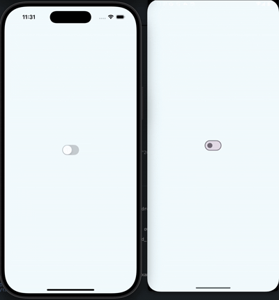

# @rn-nui/switch

Native switches for React Native with enhanced functionality. This component provides Material 3 switches on Android and uses the switch component provided by React Native for iOS.

## Installation

```bash
npm install @rn-nui/switch
```

or

```bash
yarn add @rn-nui/switch
```

### iOS Setup

No additional setup required for iOS. The component uses native iOS switches.

### Android Setup

You'll need to override the theme of your app under `/android/app/src/main/res/values/styles.xml` to inherit from Material3.

```xml
<resources>
    <!-- Base application theme. -->
    <style name="AppTheme" parent="Theme.Material3.DayNight.NoActionBar">
      <!-- Customize your theme here -->
    </style>
</resources>
```

### Expo Setup

There is no plugin for Expo yet. You'll need to manually edit the native files as described above.

## Usage

```typescript
import { Switch } from '@rn-nui/switch';

// Basic switch
<Switch value={isEnabled} onValueChange={setIsEnabled} />

// Customized switch with icon (Android only)
<Switch
  value={isEnabled}
  onValueChange={setIsEnabled}
  icon="outline_check_24"
  thumbColor={{
    false: '#f4f3f4',
    true: '#52796f'
  }}
  trackColor={{
    false: '#767577',
    true: '#81b0ff'
  }}
  iconColor={{
    false: '#6b7280',
    true: '#ffffff'
  }}
/>
```

## API Reference

#### Properties

| Prop            | Type                                                      | Platform | Default     | Description                                                  |
| --------------- | --------------------------------------------------------- | -------- | ----------- | ------------------------------------------------------------ |
| `value`         | `boolean`                                                 | Both     | `false`     | The value of the switch                                      |
| `onValueChange` | `(value: boolean) => void`                                | Both     | `undefined` | Callback that is called when the user toggles the switch     |
| `onChange`      | `(event: SwitchChangeEvent) => void`                      | Both     | `undefined` | Callback that is called with the change event                |
| `disabled`      | `boolean`                                                 | Both     | `false`     | If true, the user won't be able to toggle the switch         |
| `thumbColor`    | `{ false: ColorValue \| null; true: ColorValue \| null }` | Both     | `undefined` | Color of the grip/thumb                                      |
| `trackColor`    | `{ false: ColorValue \| null; true: ColorValue \| null }` | Both     | `undefined` | Color of the track when the switch is off/on                 |
| `icon`          | `string \| undefined`                                     | Android  | `undefined` | The Android drawable resource name for the icon on the thumb |
| `iconSize`      | `number \| undefined`                                     | Android  | `undefined` | Size of the icon                                             |
| `iconColor`     | `{ false: ColorValue \| null; true: ColorValue \| null }` | Android  | `undefined` | Color of the icon when the switch is off/on                  |
| `outlineColor`  | `{ false: ColorValue \| null; true: ColorValue \| null }` | Android  | `undefined` | Color of the outline when the switch is off/on               |

#### Events

##### onChange

Called when the user toggles the switch. The event object contains:

```typescript
type SwitchChangeEvent = NativeSyntheticEvent<{
  target: number;
  value: boolean;
}>;
```

##### onValueChange

Called when the user toggles the switch with just the new boolean value.

#### Color Configuration

All color properties accept an object with `false` and `true` keys to specify colors for the respective switch states:

```typescript
thumbColor={{
  false: '#f4f3f4',  // Color when switch is off
  true: '#52796f'    // Color when switch is on
}}
```

> Note: The Switch provided by React Native only accepts a single color value for the thumb. You were required to change the thumb color based on the value of the switch. This library allows you to specify different colors for the thumb and track in both states and the library will handle switching between the two based on the value.

#### Android Icons

On Android, you can specify an icon to display on the switch thumb using the `icon` prop. The icon should be the name of a drawable resource in your Android project:

```typescript
<Switch
  icon="outline_check_24"
  iconSize={24}
  iconColor={{
    false: '#6b7280',
    true: '#ffffff'
  }}
/>
```

### Screenshots

| Android with icon                                       | Android without icon                               | iOS                                            |
| ------------------------------------------------------- | -------------------------------------------------- | ---------------------------------------------- |
|  |  |  |
